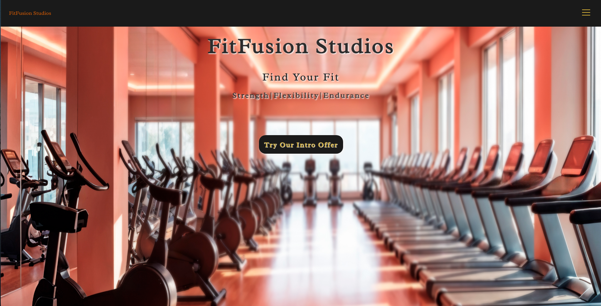
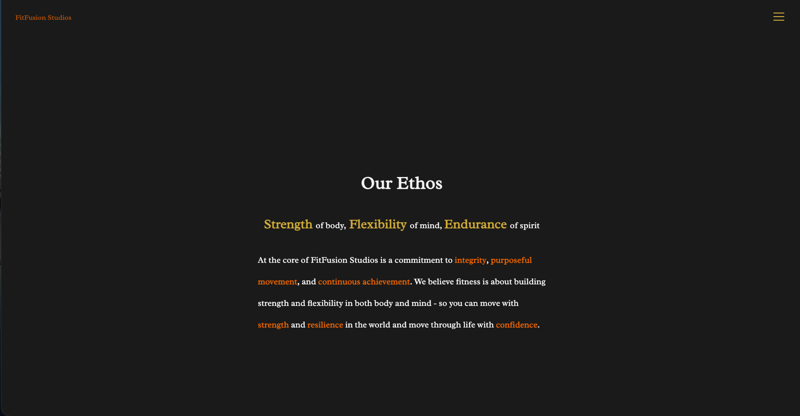
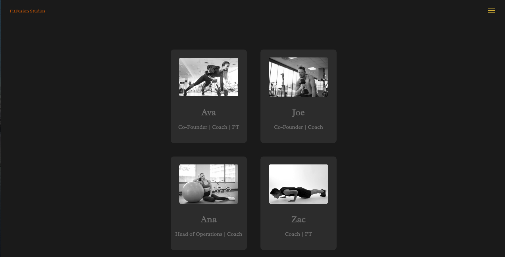
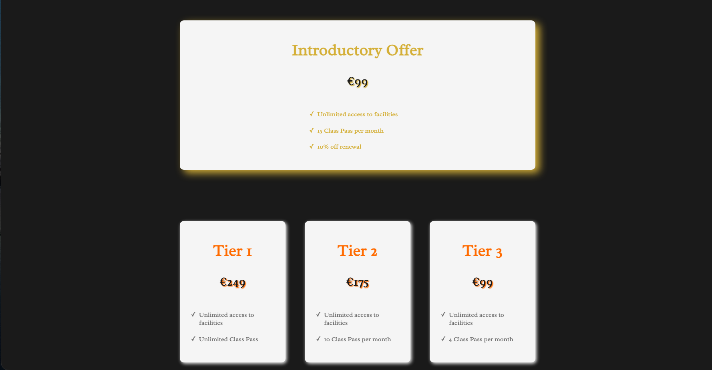
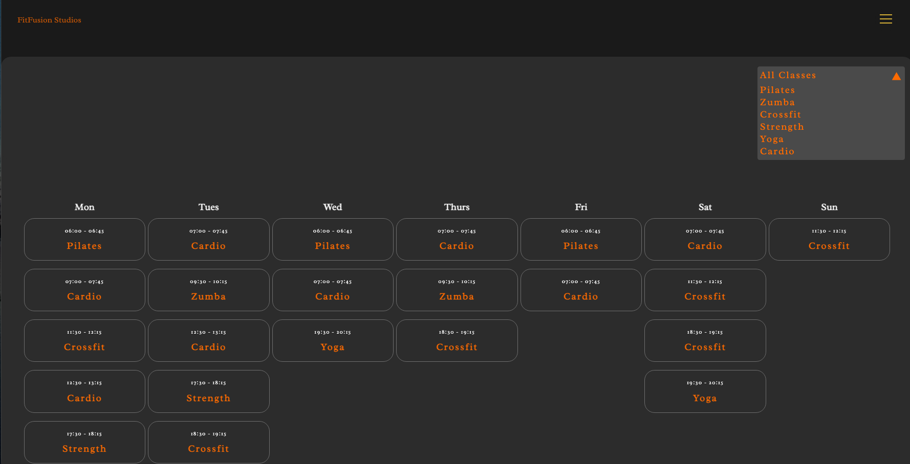

# Fit Fusion Studio App

## Description

A website for gym business showcasing its services, the gym team members, its membership packages and class schedules.

## Features

- Responsive Design
- Aesthetic UI
- Page Routing

## Technologies Used

- HTML,
- CSS,
- JavaScript,
- React
- React Router

## Installation

1. Clone the repository
   `git clone <repo address>`

2. Navigate to the project directory
   `cd <project-directory>`

3. npm run dev

## Future Improvements

- implement a class booking system
- add a members only area with secure login and user profiles
